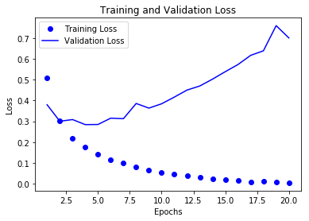
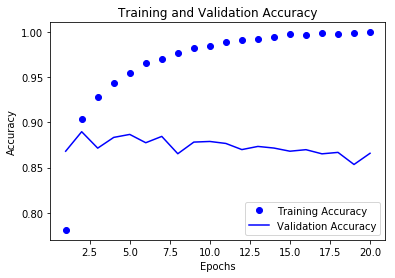

# The IMDB Dataset

> #### *Using the Keras Framework*
> ###### Section 3.4 of Deep Learning with Python

50,000 highly polarized reviews from the Internet Movie Database. It is split into 25,000 reviews for testing and 25,000 reviews for training, each having 50% positive and 50% negative reviews.

The dataset comes packaged with keras, and is preprocessed. The reviews, which are just sequences of words, have been turned into sequences of integers, where each number is a key for a word in the english dictionary.

### Loading the IMDB Dataset


```python
from keras.datasets import imdb

(train_data, train_labels), (test_data, test_labels) = imdb.load_data(num_words=10000)
```

    Using TensorFlow backend.


the argument `num_words=10000` means that the dataset will only use the first 10,000 most common words in the dataset. The most uncommon words will be discarded. This also allows us to work with a vector or manageable size. For reference, there are over 170,000 words in the english language. 

What are the data and labels?
- `train_data` and `test_data` are lists of reviews.
- `train_labels` and `test_labes` are lists of 0s and 1s, 0 indicating a *negative* review, and 1 indicating a *positive* review.

Below are the first review (first 10 words) and its label. Note: the label is 1, so this review is positive.


```python
train_data[0][:10]
```


    [1, 14, 22, 16, 43, 530, 973, 1622, 1385, 65]


```python
train_labels[0]
```


    1


Since we have restricted or dictionary to 10,000 words, no word will exceed 10,000.


```python
max([max(sequence) for sequence in train_data])
```


    9999


#### Decoding the Reviews

Just to see how this is working, here is a way to decode the raw numbers back into english words.

Below is the first review decoded.

> Some things to note:
> - `word_index` in line 1 is a dictionary mapping words to an integer index.
> - Line 3 reverses this mapping, so it is now integers to words.
> - The last line decodes the review, but notice how the numbers are offest by -3? This is becasue 0, 1, and 2 are reserved indices for "padding," "start of sequence," and "unknown."


```python
word_index = imdb.get_word_index()
reverse_word_index = dict(
    [(value, key) for (key, value) in word_index.items()])
decoded_review = ' '.join(
    [reverse_word_index.get(i - 3, '?') for i in train_data[0]])

print(decoded_review)
```

    ? this film was just brilliant casting location scenery story direction everyone's really suited the part they played and you could just imagine being there robert ? is an amazing actor and now the same being director ? father came from the same scottish island as myself so i loved the fact there was a real connection with this film the witty remarks throughout the film were great it was just brilliant so much that i bought the film as soon as it was released for ? and would recommend it to everyone to watch and the fly fishing was amazing really cried at the end it was so sad and you know what they say if you cry at a film it must have been good and this definitely was also ? to the two little boy's that played the ? of norman and paul they were just brilliant children are often left out of the ? list i think because the stars that play them all grown up are such a big profile for the whole film but these children are amazing and should be praised for what they have done don't you think the whole story was so lovely because it was true and was someone's life after all that was shared with us all


### Preparing the Data

You cannot feed a list of integers into a neural network, the list must be turned into tensors. 
There are two ways to accomplish this:

1. Pad your list so that each list has the same length, turn that list into an integer tensor of shape `(samples, word_indices)`, and then create the first layer of your network so that it is capable of handleing said integer tensors (the `Embedding` layer).

2. One-hot encode your list so that you get a vector of 0s and 1s, of length 10,000 in this example. If a word appears that index gets a 1. For example a sample of `[3, 5]` would become a vector of length 10,000 with all 0s, except for 3 and 5, which would be 1s. 

The 2nd solution is what this example will use. 

#### Now the code to actually do this!


```python
import numpy as np

def vectorize_sequences(sequences, dimension=10000):
    results = np.zeros((len(sequences), dimension)) # Create an all zero matrix
    for i, sequence in enumerate(sequences):
        results[i, sequence] = 1. # Sets specific indices of result[i] to 1
    return results

x_train = vectorize_sequences(train_data) # Vectorized traning data
x_test = vectorize_sequences(test_data) # Vectorized testing data
```

The training data now looks like this:


```python
x_train[0]
```


    array([ 0.,  1.,  1., ...,  0.,  0.,  0.])


It is also important to to vectorize the labels, but that is easy!


```python
y_train = np.asarray(train_labels).astype('float32')
y_test = np.asarray(test_labels).astype('float32')
```

### Building the Network

The setup here is one of the easiest you'll ever encounter. The input data is vectors, and labels are scalars (1s and 0s). A type of network that works well on such a problem is a simple stack of fully connected (`Dense`) layers with relu activations: `Dense(16, activation='relu')`.

The number being passed into each `Dense` layer (16 in this example) is the number of hidden units of the layer. This type of set up implaments the following chain of tensor opperations:

`output = relu(dot(W, input) + b)`

Having 16 hidden layers means that the weight matrix, `W`, will have the shape `(input_dimension, 16)`. So, the dot product with `W` will project the inputs onto a 16-dimensional space, then the bias vector `b` is added, and then the `relu`. More hidden layers allows for more complex representation, but is also more computationally expensive. It also could result in finding unwanted patterns that lead to overfitting. 

#### Architecture of this Network

There are two architectural decisions to be made when using such a stack of `Dense` layers:
- How many layers to use
- How many hidden layeres to choose

For this this example the architecture will be the following:
- Two intermediate layers with 16 inputs each
    - These will use `relu` activation
- A third layer outputs the sentiment prediction
    - This will use a sigmoid activation to output a probibility between 0 and 1.
    
##### Defining the Model


```python
from keras import models
from keras import layers

model = models.Sequential()
model.add(layers.Dense(16, activation='relu', input_shape=(10000,)))
model.add(layers.Dense(16, activation='relu'))
model.add(layers.Dense(1, activation='sigmoid'))
```

We also need a loss function and an optimizer. Since this is a binary classification problem, and the output of the data is a probability, it is best to use `binary_crossentropy` loss. "*Crossentropy* is a quantity from the field of Infor- mation Theory that measures the distance between probability distributions or, in this case, between the ground-truth distribution and your predictions."

Here is the step that configures the model with the `rmsprop` optimizer, the `binary_crossentropy` loss function, and we will monitor accuracy. 

##### Compiling the Model


```python
model.compile(optimizer='rmsprop',
              loss='binary_crossentropy',
              metrics=['acc'])
```

### Validating your Approach

To monitor the accuracy during the training, we will set aside a validation set of 10,000 samples from the original training data.


```python
x_val = x_train[:10000]
partial_x_train = x_train[10000:]

y_val = y_train[:10000]
partial_y_train = y_train[10000:]
```

### Training the Model

We will initially train with 20 epochs in mini-batches of 512 samples. We'll aslo, monitor the loss and accuracy of the 10,000 validation samples. This is done by passing the validation data into the `validation_data` argument. 


```python
history = model.fit(partial_x_train,
                    partial_y_train,
                    epochs=20,
                    batch_size=512,
                    validation_data=(x_val, y_val))
```

    Train on 15000 samples, validate on 10000 samples
    Epoch 1/20
    15000/15000 [==============================] - 3s 222us/step - loss: 0.5084 - acc: 0.7809 - val_loss: 0.3798 - val_acc: 0.8681
    Epoch 2/20
    15000/15000 [==============================] - 2s 152us/step - loss: 0.3005 - acc: 0.9043 - val_loss: 0.3003 - val_acc: 0.8897
    Epoch 3/20
    15000/15000 [==============================] - 2s 149us/step - loss: 0.2179 - acc: 0.9285 - val_loss: 0.3084 - val_acc: 0.8715
    Epoch 4/20
    15000/15000 [==============================] - 2s 153us/step - loss: 0.1750 - acc: 0.9439 - val_loss: 0.2841 - val_acc: 0.8834
    Epoch 5/20
    15000/15000 [==============================] - 2s 150us/step - loss: 0.1426 - acc: 0.9542 - val_loss: 0.2848 - val_acc: 0.8867
    Epoch 6/20
    15000/15000 [==============================] - 2s 149us/step - loss: 0.1149 - acc: 0.9653 - val_loss: 0.3151 - val_acc: 0.8775
    Epoch 7/20
    15000/15000 [==============================] - 2s 150us/step - loss: 0.0979 - acc: 0.9707 - val_loss: 0.3127 - val_acc: 0.8845
    Epoch 8/20
    15000/15000 [==============================] - 2s 151us/step - loss: 0.0807 - acc: 0.9764 - val_loss: 0.3858 - val_acc: 0.8653
    Epoch 9/20
    15000/15000 [==============================] - 2s 151us/step - loss: 0.0661 - acc: 0.9821 - val_loss: 0.3634 - val_acc: 0.8782
    Epoch 10/20
    15000/15000 [==============================] - 2s 150us/step - loss: 0.0555 - acc: 0.9851 - val_loss: 0.3843 - val_acc: 0.8789
    Epoch 11/20
    15000/15000 [==============================] - 2s 149us/step - loss: 0.0451 - acc: 0.9887 - val_loss: 0.4166 - val_acc: 0.8767
    Epoch 12/20
    15000/15000 [==============================] - 2s 152us/step - loss: 0.0385 - acc: 0.9913 - val_loss: 0.4504 - val_acc: 0.8699
    Epoch 13/20
    15000/15000 [==============================] - 2s 151us/step - loss: 0.0298 - acc: 0.9927 - val_loss: 0.4699 - val_acc: 0.8734
    Epoch 14/20
    15000/15000 [==============================] - 2s 148us/step - loss: 0.0244 - acc: 0.9949 - val_loss: 0.5029 - val_acc: 0.8716
    Epoch 15/20
    15000/15000 [==============================] - 2s 149us/step - loss: 0.0176 - acc: 0.9979 - val_loss: 0.5387 - val_acc: 0.8681
    Epoch 16/20
    15000/15000 [==============================] - 2s 153us/step - loss: 0.0169 - acc: 0.9967 - val_loss: 0.5731 - val_acc: 0.8698
    Epoch 17/20
    15000/15000 [==============================] - 2s 151us/step - loss: 0.0093 - acc: 0.9995 - val_loss: 0.6173 - val_acc: 0.8652
    Epoch 18/20
    15000/15000 [==============================] - 2s 154us/step - loss: 0.0116 - acc: 0.9975 - val_loss: 0.6392 - val_acc: 0.8668
    Epoch 19/20
    15000/15000 [==============================] - 2s 148us/step - loss: 0.0065 - acc: 0.9994 - val_loss: 0.7602 - val_acc: 0.8534
    Epoch 20/20
    15000/15000 [==============================] - 2s 153us/step - loss: 0.0043 - acc: 0.9999 - val_loss: 0.7011 - val_acc: 0.8658


The call to `model.fit()` returns a `History` object. This object has a member, `history`, which is a dictionary containing data about everything that happened during training. Here it is:


```python
history_dict = history.history
history_dict.keys()
```


    dict_keys(['val_loss', 'val_acc', 'loss', 'acc'])


### Plotting the Loss


```python
import matplotlib.pyplot as plt

loss_values = history_dict['loss']
val_loss_values = history_dict['val_loss']
acc_values = history_dict['acc']
val_acc_values = history_dict['val_acc']

epochs = range(1, len(acc_values) + 1)
```

#### Training and Validation Loss


```python
plt.plot(epochs, loss_values, 'bo', label='Training Loss')
plt.plot(epochs, val_loss_values, 'b', label='Validation Loss')
plt.title('Training and Validation Loss')
plt.xlabel('Epochs')
plt.ylabel('Loss')
plt.legend()

plt.show()
```





#### Training and Validation Accuracy


```python
plt.clf() # Clears the figure
plt.plot(epochs, acc_values, 'bo', label='Training Accuracy')
plt.plot(epochs, val_acc_values, 'b', label='Validation Accuracy')
plt.title('Training and Validation Accuracy')
plt.xlabel('Epochs')
plt.ylabel('Accuracy')
plt.legend()

plt.show()
```





#### What is happening?

The training loss is decreasing and the training accuracy is increasing with every epoch. This is expected from a gradient decent optimization, since we are aiming minimize the loss function. However, the validation loss and accuracy seem to peak at the fourth epoch. This is the perfect example of a model that performs well on the training data but not on data it has never seen before. This is overfitting: the model learns representations that are specific to the data it is seeing and does not generalize outside of the training set. Lets retrain, but stop after the fourth epoch.

##### A New Model


```python
model = models.Sequential()
model.add(layers.Dense(16, activation='relu', input_shape=(10000,)))
model.add(layers.Dense(16, activation='relu'))
model.add(layers.Dense(1, activation='sigmoid'))
model.compile(optimizer='rmsprop',
              loss='binary_crossentropy',
              metrics=['accuracy'])
model.fit(x_train, y_train, epochs=4, batch_size=512)
results = model.evaluate(x_test, y_test)
```

    Epoch 1/4
    25000/25000 [==============================] - 3s 121us/step - loss: 0.4749 - acc: 0.8217
    Epoch 2/4
    25000/25000 [==============================] - 3s 109us/step - loss: 0.2658 - acc: 0.9097
    Epoch 3/4
    25000/25000 [==============================] - 3s 106us/step - loss: 0.1982 - acc: 0.9298
    Epoch 4/4
    25000/25000 [==============================] - 3s 108us/step - loss: 0.1679 - acc: 0.9403
    25000/25000 [==============================] - 5s 196us/step


##### Let's see the reuslts!


```python
results
```


    [0.3247343580150604, 0.87275999999999998]


This pretty naive approach only reaches an accuracy of about 88% while state of the art models can get close to 95% accuracy.

#### Using the Model on New Data


```python
model.predict(x_test)
```


    array([[ 0.13868308],
           [ 0.99969959],
           [ 0.2884129 ],
           ..., 
           [ 0.07070153],
           [ 0.04275683],
           [ 0.4741073 ]], dtype=float32)


## Wrapping Up

- Usually, there will be quite a bit of preprocessing of data into tensors so it can be fed into a neural network. Sequences of words can be encoded as binary vectors, but there are also other options. 
- Stacks of `Dense` layers with `relu` activations can solve a wide range of problems.
- In a binary classification problem, your network should end with a `Dense` layer with one unit and a `sigmoid` activation.
- With such a setup, the loss function should probably be `binary-crossentropy`.
- The `rmsprop` is generally a good choice, no matter what the problem is. 
- As the neural network trains, it eventually starts overfitting, and ends up obtaining increasingly worse results on data the model has never seen before. Be sure to always monitor performance on data that is outside of the training set. 
